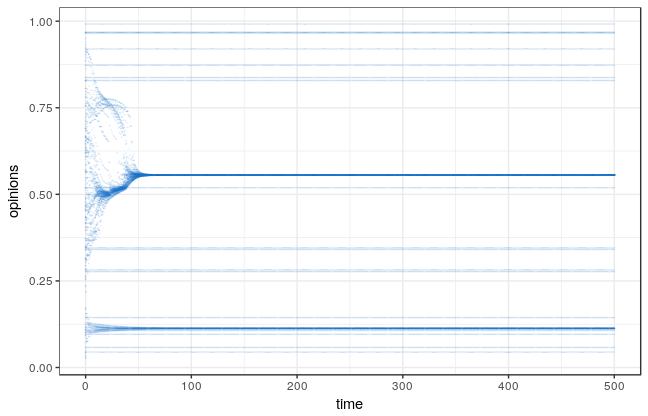

## Opinion Dynamics Simulation with SpaDES

[SpaDES](https://github.com/PredictiveEcology/SpaDES) is a simulation framework mainly used in ecology. However, it is highly customizable and modular, and can easily be adapted for other kinds of agent-based models. It allows easy reporting and plotting and once you're set up, you can extend it easily.

However, getting into it can be daunting, because you have to keep track of a lot of files and dependencies. For my first attempt at a PhD, I tried SpaDES for my purposes. I didn't go on with it, but if I ever try something similar, I would use SpaDES again.

This repository contains the setup for running a Hegselmann-Krause bounded confidence model. You can choose among different kinds of networks to situate the agents on (lattice, Barabasi-Albert and a version of a "small world" algorithm). You can plot the continuous opinion space easily with the scripts under ```analysis```. 



If you want to build your own models and don't know where to start with SpaDES, you can use this as orientation.

One of these days, I will update this old repository (SpaDES has changed and apparently my code needs adapting), and set up a Jupyter Notebook or RMarkdown tutorial. I aim to use this again in the near future for other kinds of agent-based models.
